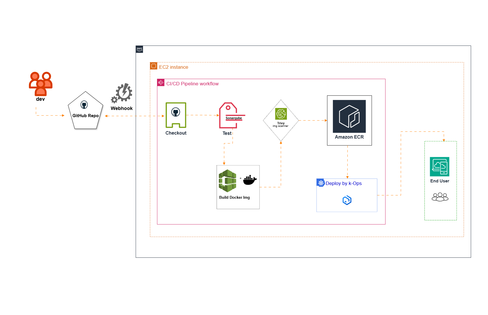

# 🚀 CI/CD Pipeline using Jenkins, Docker, SonarQube, Trivy, ECR & Kubernetes (Kops)
[](https://www.jenkins.io/)
[](https://www.docker.com/)
[](https://www.sonarqube.org/)
[](https://aquasecurity.github.io/trivy/)
[](https://docs.aws.amazon.com/AmazonECR/latest/userguide/what-is-ecr.html)
[](https://kubernetes.io/)
[](https://github.com/kubernetes/kops)


This project demonstrates an end-to-end automated **CI/CD pipeline** using Jenkins hosted on AWS EC2. It handles everything from GitHub push to Kubernetes deployment using tools like Docker, SonarQube, Trivy, and AWS ECR.

---

##  Table of Contents

1. [Project Overview](#project-overview)  
2. [Architecture](#architecture)  
3. [Pre-Requisites](#pre-requisites)  
4. [Implementation](#implementation)  
   1. [Git Setup](#1-git-setup)  
   2. [Jenkins & Docker Setup](#2-jenkins--docker-setup)  
   3. [Test Analysis (SonarQube)](#3-test-analysis-sonarqube)  
   4. [Build Stage (Docker)](#4-build-stage-docker)  
   5. [Image Scan (Trivy)](#5-image-scan-trivy)  
   6. [Publish to ECR](#6-publish-to-ecr)  
   7. [Deploy to Kubernetes (Kops)](#7-deploy-to-kubernetes-kops)  
5. [Conclusion / Outcome](#conclusion--outcome)  
6. [Author](#author)  

---

##  Project Overview

## Introduction

This project implements a fully automated CI/CD pipeline using Jenkins on AWS, enabling seamless code delivery from GitHub to Kubernetes. It ensures code quality, security, and continuous deployment through an integrated DevOps workflow.

### Key Features

-	Webhook-triggered CI/CD pipeline using Jenkins Declarative Pipeline.
-	Code quality analysis with SonarQube integrated into the build process.
-	Container image security scanning with Trivy before deployment.
-	Automated Docker image publishing to AWS ECR.
-	Kubernetes (Kops) deployment of containerized applications with updated kubeconfig.

##  Architecture


GitHub Repo → Jenkins → SonarQube → Docker Build → Trivy Scan → Push to ECR → Deploy to Kubernetes (via Kops)

# Pre-Requisites

## Required Accounts and Tools

### 1. AWS Account Setup
- Create an [AWS Free Tier Account](https://aws.amazon.com/free/)
- Install AWS CLI v2
  ```bash
  # For Linux
  curl "https://awscli.amazonaws.com/awscli-exe-linux-x86_64.zip" -o "awscliv2.zip"
  unzip awscliv2.zip
  sudo ./aws/install

  # For macOS
  brew install awscli

  # Configure AWS CLI
  aws configure
  ```

### Development Tools
- **Git**: Version control system
  ```bash
  # For Linux
  sudo apt-get update
  sudo apt-get install git

  # For macOS
  brew install git
  ```

### 2. CI/CD Integration
- **SonarCloud Account**
  - Sign up at [SonarCloud](https://sonarcloud.io/)
  - Generate authentication token
  - Configure project settings:
    ```bash
    # Add to pom.xml
    <properties>
        <sonar.projectKey>your_project_key</sonar.projectKey>
        <sonar.organization>your_organization</sonar.organization>
        <sonar.host.url>https://sonarcloud.io</sonar.host.url>
    </properties>
    ```

---

## 3. Test Analysis (SonarQube)
- **Run SonarQube in Docker**
  ```bash
  docker run -d --name sonarqube -p 9000:9000 sonarqube
  ```
- Install SonarQube Scanner Plugin
  In Jenkins: Manage Jenkins → Plugin Manager

- Configure SonarQube in Jenkins
  Add server URL & token in Manage Jenkins → Configure System

- **Install Sonar Scanner in EC2**
  ```bash
  wget https://binaries.sonarsource.com/Distribution/sonar-scanner-cli/sonar-scanner-<version>.zip
  unzip sonar-scanner-*.zip

## 4. Build Stage (Docker)

- **Build Docker image**
  ```bash
  docker build -t <image-name> .
  ```

## 5. Image Scan (Trivy)

- **Install Trivy**
  ```bash
  wget https://github.com/aquasecurity/trivy/releases/latest/download/trivy_0.48.0_Linux-64bit.deb
  sudo dpkg -i trivy_0.48.0_Linux-64bit.deb
  ```
- **Scan Docker image**
    ```bash
    trivy image <image-name>
    ```

 ## 6. Publish to ECR

- Create ECR private repo
  Use AWS Console or CLI

- Install AWS Credential Plugin in Jenkins

- Configure AWS Credentials in Jenkins
  Use Access key ID and Secret access key

- **Push Docker image to ECR**
  ```bash
  aws ecr get-login-password | docker login --username AWS --password-stdin <account>.dkr.ecr.<region>.amazonaws.com
  docker tag <image-name> <ecr-uri>
  docker push <ecr-uri>
  ```

## 7. Deploy to Kubernetes (Kops)

- Create Kubernetes cluster using Kops

- **Update kubeconfig in Jenkins**
  ```bash
  aws s3 cp s3://<your-kops-state-store>/kubeconfig.yaml ~/.kube/config
  ```
- **Deploy Application**
  ```bash
  kubectl apply -f deployment.yaml
   ```

## Conclusion / Outcome

- Fully automated pipeline from GitHub to Kubernetes using Jenkins.

- Integrates code quality analysis, security scanning, and ECR artifact publishing.

- Demonstrates infrastructure provisioning and deployment using modern DevOps practices.

## 🛠️ Author 

This project is maintained by **[Gnanaprakash](https://github.com/GG-Prakash)**💡.
Your feedback and contributions are welcome!

📧 **Connect with me:**
- **GitHub**: [@Gnanaprakash G](https://github.com/GG-Prakash)
- **Portfolio**: [View My Profile](https://gnanaprakash-devops.netlify.app/)
- **LinkedIn**: [GnanaPrakash G](www.linkedin.com/in/gg-prakash)

---

## ⭐ Support the Project

If you found this project helpful, please consider:
- **Starring** ⭐ the repository
- **Sharing** it with your network
- **Contributing** to its improvement

> [!Important]
> This documentation is continuously evolving. For the latest updates, please check the repository regularly.


  